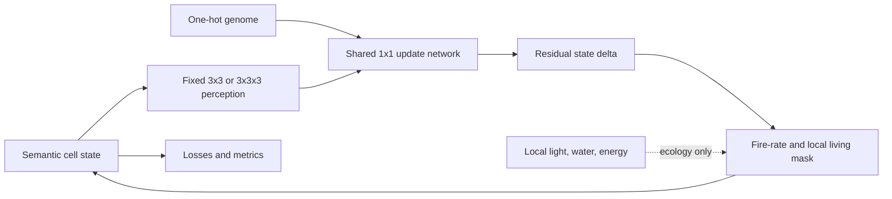

# MorphoVoxel

MorphoVoxel is a reproducible research prototype for testing whether one genome-conditioned, strictly local neural cellular automaton (NCA) can grow multiple stable morphologies in a standalone 3D voxel world and regenerate them after damage. A 2D system provides the cheap first validation; a modular finite-resource ecology is a later extension.

Neural cellular automata and artificial-life voxel systems are established research areas. This project does not claim either as a new invention. Its intended contribution is a controlled comparison of conditional growth, specialized models, damage-augmented regeneration, spatial scaling, and resource-limited competition. Smoke outputs verify plumbing only; they are not scientific evidence, and hypotheses are not supported until the configured multi-seed experiments have run.

## Research questions and hypotheses

The primary question is whether one genome-conditioned 3D NCA can use only local voxel interactions to grow several morphologies from identical seeds while retaining regeneration. Experiments test shared versus specialized parameter efficiency and accuracy, damage augmentation, severity and structural damage effects, larger-grid execution, and long-rollout stability. Ecology asks whether finite light and water change growth and competitive outcomes among fixed pretrained genomes; it is not open-ended evolution.

## Architecture



Every update uses the same weights at every location, rollout step, batch element, and world size. The 2D perception bank is identity, Sobel x/y, and Laplacian. The 3D bank is identity, three central gradients, and a six-neighbor Laplacian. A local max-pooled occupancy mask prevents growth farther than one cell per update.

## State representation

Tensors are `[B,C,H,W]` in 2D and `[B,C,D,H,W]` in 3D. Channel zero is continuous occupancy; subsequent channels are material logits, optional energy, and hidden communication channels. Rendering maps these semantic values to colors but RGB is never the simulated state. Damage zeroes every channel, including hidden state and energy.

One-hot genomes are broadcast spatially and concatenated after local perception. Four 3D classes are included: branching, conical, radial, and mushroom. Procedural targets are deterministic for target name, size, parameters, and seed. The state pool stores state, genome, and age together so pairing cannot drift.

## Phases

1. Single-target 2D growth and persistence.
2. Single-target 3D voxel growth.
3. One shared, genome-conditioned model and per-target specialized baselines.
4. State-pool damage training plus regeneration sweeps across seven operators and four severity levels.
5. Fixed-genome competition through occupied space, top-down light, shared diffusing water, and local energy.

The required core is phases 1–4. Genome interpolation is exploratory and reports collapse as readily as hybrids. Resource-aware retraining is separated from the required energy-gated fixed-morphogenesis ecology mode.

## Installation

Python 3.11 or newer is required.

```bash
python -m venv .venv
.venv/Scripts/python -m pip install -e ".[test]"  # Windows
# .venv/bin/python -m pip install -e '.[test]'    # Linux/macOS
pytest
```

CPU and CUDA devices are supported through each YAML `device` field. `device: auto` selects CUDA when the installed PyTorch build can access it, otherwise CPU; an explicit unavailable `cuda` request fails clearly. Install a CUDA-enabled wheel using the current command from the [official PyTorch selector](https://pytorch.org/get-started/locally/). The smoke configurations stay on CPU because launch overhead can dominate their tiny workloads, while full configurations default to `auto`. Full 32³ backpropagation through 48–96 steps can require many gigabytes of accelerator memory; reduce batch size, rollout length, hidden channels, or model width first.

## Commands

Interactive local dashboard:

```bash
python -m morphovoxel.ui --open
```

The dashboard navigates every preset and saved run, previews GIF/PNG artifacts and metrics, launches edited YAML as isolated UI jobs, streams logs, and can stop active jobs. **View Checkpoints** opens any training run with `config.yaml` and a local `latest.pt`/`best.pt` checkpoint: double-click to place a seed, click or drag to erase, then play, pause, single-step, reset, change a conditional genome, or inspect editable 3D slices and projections. 3D runs open in the cube view by default: drag to rotate, use the wheel to zoom, and switch to a slice or projection to edit. Choose Auto/CPU/CUDA and enable the live organism view before launch; during training it updates once every 10 iterations with that iteration's completed rollout. It binds to `127.0.0.1:8765` by default and adds no web-framework dependency.

Smoke checks:

```bash
python -m morphovoxel.train_2d --config configs/smoke_2d.yaml
python -m morphovoxel.train_3d --config configs/smoke_3d.yaml
```

Core and ecology runs:

```bash
python -m morphovoxel.train_2d --config configs/phase1_2d.yaml
python -m morphovoxel.train_3d --config configs/phase2_3d.yaml
python -m morphovoxel.train_conditional --config configs/phase3_conditional.yaml
python -m morphovoxel.train_conditional --config configs/phase4_regeneration_training.yaml
python -m morphovoxel.evaluate_regeneration --config configs/phase4_regeneration.yaml
python -m morphovoxel.run_ecology --config configs/phase5_ecology.yaml
python scripts/run_ecology_experiment.py --config configs/ecology_experiments.yaml
python -m morphovoxel.visualize --run-dir runs/<run_name>
python scripts/run_full_experiment.py --config configs/full_experiment.yaml
```

Baselines and controlled analyses:

```bash
python scripts/run_specialized_baseline.py --config configs/phase2_3d.yaml
python scripts/run_interpolation.py --config configs/phase3_conditional.yaml --checkpoint runs/phase3_conditional/checkpoints/latest.pt
python scripts/run_scaling_experiment.py --config configs/phase3_conditional.yaml --checkpoint runs/phase3_conditional/checkpoints/latest.pt
python scripts/summarize_results.py --runs-root runs
python scripts/generate_report.py --run-dir runs/<run_name>
```

## Training and comparisons

Training uses variable rollouts, stochastic asynchronous updates, gradient clipping, deterministic seeds, checkpoint/resume state, component CSV logs, and explicit non-finite loss failure. Loss terms cover occupancy, target-conditioned material classification, outside-target leakage, and optional post-horizon stability. Damage training samples intermediate states, refreshes some from seeds, applies configured deletion operators, and commits detached states back to the genome-safe pool.

The specialized baseline uses one independent NCA per target. The shared comparison uses one four-genome NCA. Fair studies must match optimizer, training budget, architecture width, rollout distribution, targets, and evaluation seeds, then report individual and total specialized parameter counts. The regeneration comparison likewise changes damage augmentation only.

## Metrics

Saved metrics include soft and thresholded IoU, Dice, target recall, empty-space precision, incorrect-growth fraction, component count, largest-component fraction, centroid and bounding-box errors, volume, surface approximation, compactness, radius, height, and recovery measurements. Recovery fraction is correctly restored removed target voxels divided by removed target voxels. Recovery time is the first post-damage step that remains over the threshold for the configured consecutive steps. Paired bootstrap intervals and permutation tests are available; the software does not fabricate significance.

Ecology records each organism separately: light and water absorbed, energy, volume, height, spread, and maintenance/growth/remodeling costs. Organisms have separate state tensors and compete only through space, shading, and a shared water field.

## Outputs

Each `runs/<name>` directory contains the exact YAML snapshot, metadata (time, device, PyTorch version, parameter count, seeds, command, and Git commit when available), CSV logs, checkpoints, NumPy rollout states and targets, GIFs, projections, hidden-channel panels, metric plots, and summaries. With `live_preview: true`, training atomically overwrites `visualizations/live.png` with the completed rollout from iterations 10, 20, 30, and so on, without creating thousands of image files. The final GIF and rollout archive are still generated at the end. Visualization reads saved states and never retrains.

## Limitations

Procedural targets are deliberately simple, occupancy is a continuous unconstrained NCA channel clamped only for losses and observation, and connected-component analysis is CPU-based. Smoke training is too short to yield recognizable morphology. Full scientific claims require multiple training and evaluation seeds, matched budgets, confidence intervals, and inspection of failures. Ecology mode A gates growth but does not teach adaptive developmental policies; mode B requires a separate controlled retraining study. No reproduction, weight mutation, predation, complex chemistry, game engine, or infinite world is implemented.
