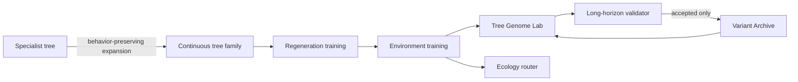

# MorphoVoxel architecture

MorphoVoxel is organized around an organism-design loop rather than a sequence of claims about an experiment:



The older phase presets remain usable, but the tree pipeline is the primary product path.

## The update boundary

Three values must remain separate:

| Value | Lifetime | Representation | Meaning |
| --- | --- | --- | --- |
| Genome | Fixed for one planted organism | Discrete family + 10 bounded genes + fixed style seed | Inherited identity |
| Environment | Changes with place and time | 12 local voxel fields | Conditions sensed before an update |
| Cell state | Changes every NCA step | Occupancy, material logits, optional energy, hidden channels | Body and developmental memory |

The model boundary is:

```text
next_state = NCA(perception(cell_state), organism_genome, local_environment)
```

Local perception uses fixed spatial filters. Genome values are broadcast because they belong to the whole organism. Spatial environment values remain fields rather than being hidden inside the genome. The update network proposes a residual delta, stochastic fire-rate masking makes updates asynchronous, and the before/after living-mask intersection clears every channel of cells that are no longer locally alive.

In the ecology implementation, per-organism energy is maintained by the world and supplied through local context; the ordinary tree-training state contains occupancy, material, and hidden channels. The separation is semantic even where storage differs.

## Specialist and continuous-family models

| Specialist | Continuous family |
| --- | --- |
| No genome input | 16-value model genome: 4-family one-hot, 10 semantic genes, 2 deterministic style features |
| One target and one default tree genome | Many deterministic genome-conditioned targets |
| Easier to stabilize and diagnose | Compact shared rule for variation and interpolation |
| Independent capacity and training schedule | Shared capacity can create interference between organisms |
| Best first step for a new organism | Best after a reliable specialist exists |

`tree_family.yaml` initializes from `runs/tree_specialist/checkpoints/best.pt`. The conversion copies compatible perception/update weights, expands the first update layer, and initializes new genome/environment weights so the default family initially behaves like the specialist. Checkpoint metadata records model kind and input schemas; mismatched tensor shapes are an error.

Separate specialist checkpoints remain useful. Ecology's model router groups organisms by checkpoint and sends each group through its assigned model. This permits shared-family and separate-model studies without combining their cellular states or identities.

## Why one-hot interpolation was insufficient

The legacy conditional model uses four one-hot labels (`branching`, `conical`, `radial`, and `mushroom`). Those vectors select classes. Their midpoint is only a soft combination of labels, and the legacy training distribution did not assign that midpoint a target or an interpretable meaning.

The tree genome retains a discrete family for discontinuous topology (`branching`, `conifer`, `broad_canopy`, or `weeping`) and provides ten continuous genes in `[-1, 1]`:

- height
- trunk thickness
- branch density
- branch inclination
- branch length
- canopy spread
- taper
- asymmetry
- light tropism
- root/canopy allocation

The style seed is selected once and deterministically encoded as two model features. It is not the per-step fire-mask seed. Identical genome JSON and target conditions reproduce the same procedural target; simulation fire masks can still produce different rollouts.

Interpolation is defined only between genomes in the same discrete family. Mutation is bounded and can lock selected genes. These operations become meaningful only because training generates the matching procedural target for each sampled genome.

## Target generation and curriculum

The procedural target generator maps `(tree genome, environment specification, world size)` to occupancy and material targets. It is intentionally semantic and deterministic; no VAE is required for this first implementation.

Family training keeps these items paired in every state-pool slot:

- cellular state and age
- semantic genome and exact model vector
- fixed style seed
- target occupancy and materials
- environment specification and local context
- creation method (`random`, `interpolation`, or `mutation`)

The curriculum starts with all four families balanced in a narrow continuous-gene region, widens the gene range, introduces within-family interpolation, and adds bounded mutation while keeping the environment fixed. Environment variation is reserved for the later environment stage so the first shared model must learn genome separation without a second moving condition. Continued states are compared directly with their own target after randomized persistence horizons. Dead and worst pool samples are reseeded; mature low-loss samples can be damaged only when damage leaves a living remnant.

`tree_regeneration.yaml` resumes the full-range family checkpoint and applies damage throughout its curriculum. `tree_environment.yaml` resumes that exact architecture and introduces randomized environments from the beginning. `resume` is appropriate only when all model dimensions match; specialist-to-family expansion uses `initialize_from_specialist` instead.

## Stability and checkpoint selection

Training loss covers:

- target occupancy and materials
- growth outside the target
- raw occupancy outside `[0, 1]`
- excessive occupancy, material, and hidden-channel magnitude
- direct long-horizon continuation error

Finite training loss is necessary but not sufficient. The deterministic validation panel crosses default, boundary/corner, random, interpolated, mutated, and archived genomes with fixed fire-mask seeds and representative environments. Each trial checks state finiteness and magnitude, occupancy-range violations, connectedness, size/shape descriptors, target agreement, drift, and damage recovery.

The full presets use 256-step checkpoint validation plus recovery. `best.pt` advances when the configured worst-case or low-percentile panel score matches or improves, preventing a run whose strict score remains zero from freezing at its first validation window. Its validation must still say `accepted: true` before it is treated as stable. `latest.pt` remains the final optimizer state. Validation uses no gradients, so long horizons add runtime but not backpropagation memory.

## Variant Archive admission

A generated candidate is provisional until validation finishes. The Tree Genome Lab can randomize, mutate, interpolate, lock genes, reproduce JSON, and validate a candidate. Archive admission requires a complete accepted report; the default archive threshold is at least 512 steps and 128 recovery steps.

An archive record stores the semantic genome, environment, style seed, model/checkpoint identity, creation method and parents, validation metrics, morphology descriptors, target/final voxel data, and previews. The manifest is written only after the record is complete. Reloading uses the stored semantic genome rather than trying to infer it from an image.

“Novel” means different from archive entries under configured morphology descriptors. It does not mean biologically novel or guaranteed outside the training set. A bounded mutation at the edge of the trained domain is still out-of-distribution in the statistical sense and may fail. Clamping prevents invalid gene values; validation, not clamping, determines admission.

## Environment conditioning and ecology

The 12 local context channels are light, water, energy, substrate, obstacles, neighboring-organism occupancy, three gravity components, and three wind components. They reach the NCA before it proposes growth. Ecology then applies resource transport, energy costs, collision resolution, and ownership accounting.

The default shared ecology preset uses semantic `tree_genomes`, `context_channels: 12`, and the environment-trained family checkpoint. A specialist-routed ecology can instead use:

```yaml
specialist_checkpoints:
  oak: runs/oak/checkpoints/best.pt
  pine: runs/pine/checkpoints/best.pt
organism_model_ids: [oak, pine]
context_channels: 0  # use 12 only if both specialist checkpoints were trained with it
```

All specialists in one router config must match the declared state width and context channel count. A legacy checkpoint without environment inputs follows the explicit zero/default-context compatibility path.

The learned-context caveat matters: supplying light or neighbors to an untrained model does not make its response adaptive. The ecology rules can mechanically gate growth and resources, but learned tropism or crowding responses require training targets and transitions containing those signals. Even an environment-trained model is not evidence of cooperation, selection, or open-ended evolution.

## Presets and dependencies

| Preset | Purpose | Prerequisite |
| --- | --- | --- |
| `tree_specialist.yaml` | Default branching-tree specialist | None |
| `tree_family.yaml` | Continuous shared family | Specialist `best.pt` |
| `tree_regeneration.yaml` | Damage-trained family | Family `best.pt` |
| `tree_environment.yaml` | Local-context family | Regeneration `best.pt` |
| `tree_ecology.yaml` | Shared-family resource world | Environment `best.pt` |
| `smoke_tree_*.yaml` | Independent CPU plumbing checks | None; output is untrained |

Run all full stages:

```powershell
.venv\Scripts\python scripts\run_full_experiment.py --config configs\full_experiment.yaml
```

For a first useful run, train only the prerequisite specialist:

```powershell
.venv\Scripts\python -m morphovoxel.train_3d --config configs\tree_specialist.yaml
```

Run only the independent smoke checks:

```powershell
.venv\Scripts\python -m morphovoxel.train_3d --config configs\smoke_tree_specialist.yaml
.venv\Scripts\python -m morphovoxel.train_conditional --config configs\smoke_tree_family.yaml
.venv\Scripts\python -m morphovoxel.train_conditional --config configs\smoke_tree_regeneration.yaml
.venv\Scripts\python -m morphovoxel.train_conditional --config configs\smoke_tree_environment.yaml
.venv\Scripts\python -m morphovoxel.run_ecology --config configs\smoke_tree_ecology.yaml
```

The legacy `phase*.yaml`, one-hot conditional studies, regeneration evaluator, and ecology matrix remain available for old checkpoints and controlled comparisons. They do not define the new architecture.

## RTX 4050 Laptop GPU envelope

The full tree presets deliberately begin with FP32, `world_size: 16`, `batch_size: 4`, eight hidden channels, and width 64. These are conservative starting settings for a 6 GB RTX 4050 Laptop GPU, not a guarantee for every driver or concurrently loaded application.

The repository's focused CUDA probe used PyTorch 2.13.0+cu126 on an RTX 4050 with 5.997 GiB usable. A width-64, world-16, batch-4 FP32 pass through 48 growth + 32 persistence steps, backward, and Adam remained finite, took 0.943 seconds, and peaked at 878.44 MiB allocated / 1030 MiB reserved. A separate 256-step no-gradient rollout remained finite, took 0.203 seconds, and peaked at 19.05 MiB allocated. Those numbers establish feasibility and memory headroom for one short probe, not end-to-end training duration, convergence, or morphology quality.

- Keep 256–512-step validation in inference/no-gradient mode.
- At `world_size: 24`, begin with batch size 1 or 2.
- On an out-of-memory error, reduce batch size before model width or state capacity.
- Shorten rollout and persistence ranges if activation memory remains too high.
- Close other GPU-heavy applications and verify that PyTorch sees CUDA.
- Enable mixed precision only after FP32 rollouts remain finite and bounded.

The complete default chain performs 17,000 optimizer iterations before counting the cross-product of genomes, fire seeds, environments, and recovery trials. On an RTX 4050 laptop, treat it as a multi-hour job that may run overnight; cooling, power mode, driver state, and validation-panel size can matter more than nominal GPU model. The `16³`/batch-4 baseline is meant to fit within 6 GB, but concurrent GPU applications can still cause an allocation failure. Smoke runs verify installation in seconds or minutes but cannot establish morphology quality.

## Compatibility and current limits

- Existing specialist and legacy one-hot checkpoints remain viewable when their recorded dimensions match.
- Old models without context receive no context or an explicit zero/default context path.
- Checkpoint format, model kind, genome/environment schema versions, target generator version, training ranges, validation panel, and best persistence score are stored where applicable.
- Procedural-tree target schema version 2 fixes empty thin-trunk targets on even grids; version-1 tree checkpoints are rejected and must be retrained through the pipeline.
- Procedural tree targets are stylized voxel organisms, not botanical simulations.
- Interpolation does not cross discrete topology families.
- A family model may trade specialist quality for shared capacity.
- Connected-component measurements are CPU-side and can add validation time.
- Ecology has finite worlds, fixed resource rules, and no reproduction, inherited weight mutation, or evolutionary selection loop.

## Design references

These works guide design choices; MorphoVoxel does not claim to reproduce their results:

- [Growing Neural Cellular Automata](https://distill.pub/2020/growing-ca/) — living masks, state-pool training, and damage/recovery as useful design precedents.
- [Goal-Guided Neural Cellular Automata](https://arxiv.org/abs/2205.06806) — a reference for conditioning one local update rule on an explicit goal.
- [Neural Cellular Automata Manifold](https://openaccess.thecvf.com/content/CVPR2021/html/Hernandez_Neural_Cellular_Automata_Manifold_CVPR_2021_paper.html) — a reference for exploring continuously conditioned NCA behavior.
- [Growing 3D Artefacts and Functional Machines with Neural Cellular Automata](https://arxiv.org/abs/2103.08737) — a reference for extending learned cellular growth into 3D voxel domains.
